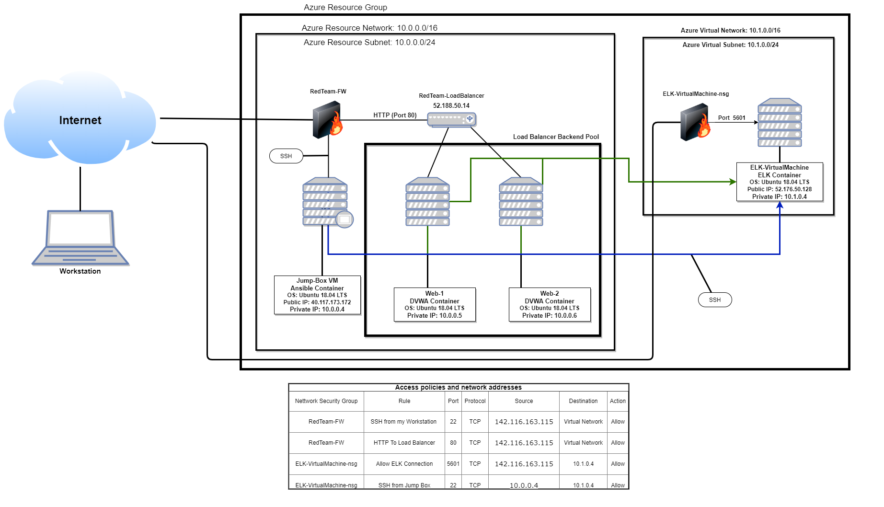
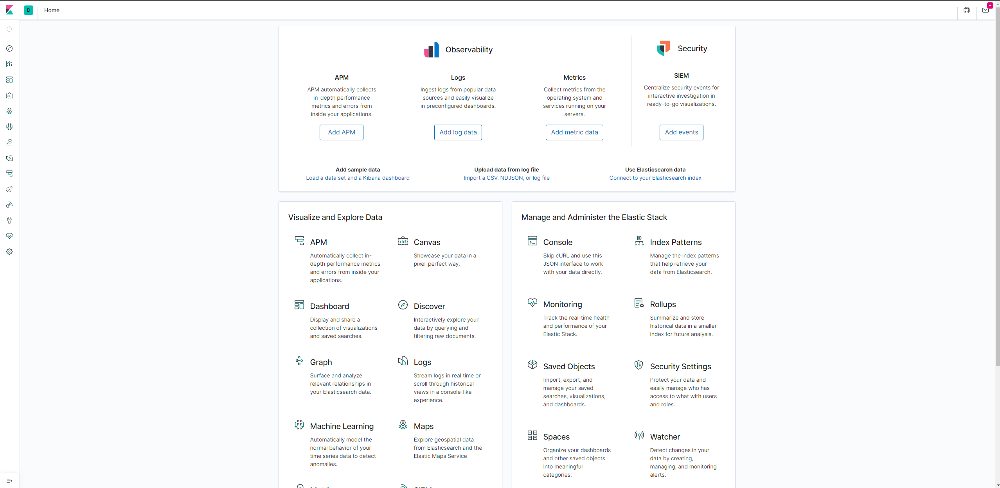
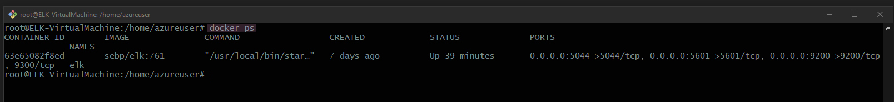
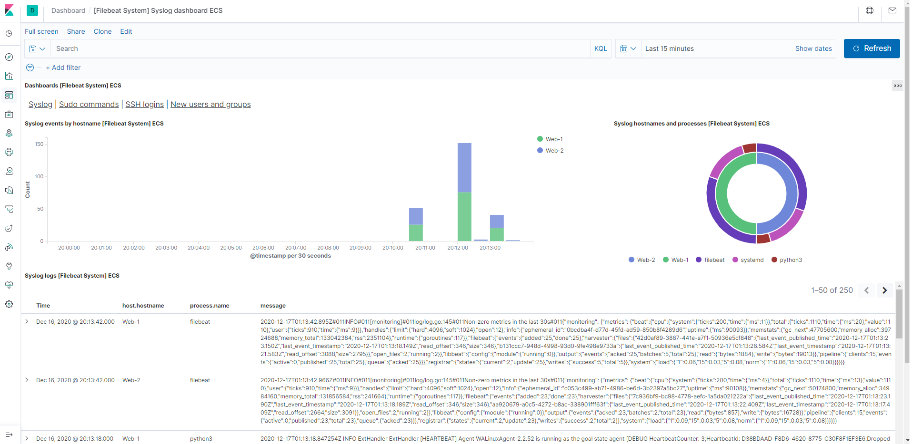
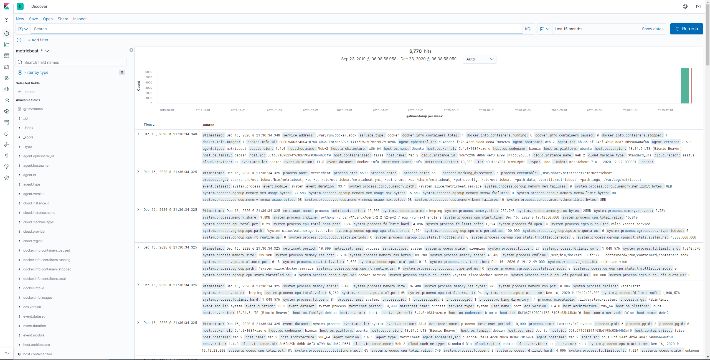

##Prueba de cambio

## Automated ELK Stack Deployment

This document contains the following details:

- Description of the Topology
- Access Policies
- ELK Configuration
  - Beats in Use
  - Machines Being Monitored

- How to Use the Ansible Build

## The files in this repository were used to configure the network depicted below.

&nbsp;

&nbsp;

These files have been tested and used to generate a live ELK deployment on Azure. They can be used to either recreate the entire deployment pictured above. Alternatively, select portions of the __yml (playbook)__ file may be used to install only certain pieces of it, such as Filebeat.

&nbsp;

* A continuacion se explica una breve descripcion y como instalar los siguientes programas

  - __DVWA__: is a PHP/MySQL web application, whose main goal is to be an aid for security professionals to test their skills and tools in a legal environment.
  
  &nbsp;

  - __ELK__: "ELK" is the acronym for three open source projects: Elasticsearch, Logstash, and Kibana. Elasticsearch is a search and analytics engine. Logstash is a server‑side data processing pipeline that ingests data from multiple sources simultaneously, transforms it, and then sends it to a "stash" like Elasticsearch. Kibana lets users visualize data with charts and graphs in Elasticsearch.

  &nbsp;

  - __Filebeat__: is a lightweight shipper for forwarding and centralizing log data. Installed as an agent on your servers, Filebeat monitors the log files or locations that you specify, collects log events, and forwards them either to Elasticsearch or Logstash for indexing.

  &nbsp;

  - __Metricbeat__: is the basic logic for collecting data from a specific service, such as Redis, MySQL, and so on. The module specifies details about the service, including how to connect, how often to collect metrics, and which metrics to collect.

  &nbsp;

## Installation and configuration of services

&nbsp;
  
### Playbooks to install/deploy into the [Webservers] group
&nbsp;
 

 *  This is the ansible-playbook to install DVWA in ansible container:

        ---
        - name: Config Web VM with Docker
          hosts: webservers
          become: true
          tasks:
        - name: docker.io
          apt:
            update_cache: yes
            name: docker.io
            state: present

        - name: Install pip3
          apt:
            name: python3-pip
            state: present

        - name: Install Docker python module
          pip:
            name: docker
            state: present

        - name: download and launch a docker web container
          docker_container:
            name: dvwa
            image: cyberxsecurity/dvwa
            state: started
            restart_policy: always
            published_ports: 80:80

        - name: Enable docker service
          systemd:
            name: docker
            enabled: yes

 &nbsp;

### Filebeat-playbook instalattion file:

&nbsp;

* The .yml file to install the filebeat extension in our VMs

      ---
      - name: Installing and Launch Filebeat
        hosts: webservers
        become: yes
        tasks:
          # Use command module
        - name: Download filebeat .deb file
          command: curl -L -O https://artifacts.elastic.co/downloads/beats/filebeat/filebeat-7.4.0-amd64.deb

          # Use command module
        - name: Install filebeat .deb
          command: dpkg -i filebeat-7.4.0-amd64.deb

          # Use copy module
        - name: Drop in filebeat.yml
          copy:
            src: /etc/ansible/files/filebeat-config.yml
            dest: /etc/filebeat/filebeat.yml

          # Use command module
        - name: Enable and Configure System Module
          command: filebeat modules enable system

          # Use command module
        - name: Setup filebeat
          command: filebeat setup

          # Use command module
        - name: Start filebeat service
          command: service filebeat start

&nbsp;

## Metricbeat-playbook instalattion file:

&nbsp;

* The .yml file to install the metricbeat extension in our VMs

        ---
        - name: Install metric beat
          hosts: webservers
          become: true
          tasks:
            # Use command module
          - name: Download metricbeat
            command: curl -L -O https://artifacts.elastic.co/downloads/beats/metricbeat/metricbeat-7.4.0-amd64.deb

            # Use command module
          - name: install metricbeat
            command: dpkg -i metricbeat-7.4.0-amd64.deb

            # Use copy module
          - name: drop in metricbeat config
            copy:
              src: /etc/ansible/files/metricbeat-config.yml
              dest: /etc/metricbeat/metricbeat.yml

            # Use command module
          - name: enable and configure docker module for metric beat
            command: metricbeat modules enable docker

            # Use command module
          - name: setup metric beat
            command: metricbeat setup

            # Use command module
          - name: start metric beat
            command: service metricbeat start

&nbsp;

## Filebeat configuration file:

&nbsp;

* Modify [filebeat-configuration.yml](Scripts/filebeat-configuration.yml) to set the connection information:

        setup.kibana:
          host: "10.1.0.4:5601"

        output.elasticsearch:
        #Array of hosts to connect to.
        hosts: ["10.1.0.4:5601"]
        username: "elastic"
        password: "changeme"

 
## Metricbeat configuration file:

&nbsp;

We repeat the configuration we made in the last script but now with metricbeat
  
  

* Modify [metricbeat-configuration.yml](Scripts/metricbeat-configuration.yml) to set the connection information:

        setup.kibana:
        host: "10.1.0.4:5601"

        output.elasticsearch:
        #Array of hosts to connect to.
        hosts: ["10.1.0.4:5601"]
        username: "elastic"
        password: "changeme"

&nbsp;

## Playbooks to install/deploy into the [Elk] group

  

        ---
        - name: Configure Elk VM with Docker
          hosts: elkservers
          remote_user: elk
          become: true
          tasks:
        # Use apt module
        - name: Install docker.io
          apt:
            update_cache: yes
            name: docker.io
            state: present

          # Use apt module
        - name: Install pip3
          apt:
            force_apt_get: yes
            name: python3-pip
            state: present

          # Use pip module
        - name: Install Docker python module
          pip:
            name: docker
            state: present

          # Use sysctl module
        - name: Use more memory
          sysctl:
            name: vm.max_map_count
            value: "262144"
            state: present
            reload: yes

          # Use docker_container module
        - name: download and launch a docker elk container
          docker_container:
            name: elk
            image: sebp/elk:761
            state: started
            restart_policy: always
            published_ports:
              - 5601:5601
              - 9200:9200
              - 5044:5044

&nbsp;

## Description of the Topology

The main purpose of this network is to expose a load-balanced and monitored instance of DVWA, the D*mn Vulnerable Web Application.

Load balancing ensures that the application will be highly __(availability)__, in addition to restricting __traffic (overflow)__ to the network.

- What aspect of security do load balancers protect? 

  - Load balancers protect servers/clients from an overload of traffic on the flow over the connections to prevent them from collapsing by not being able to process too much information, distributing it equally over all the available servers

- What is the advantage of a jump box?

  - A jump box is a secure computer that all admins first connect to before launching any administrative task or use as an origination point to connect to other servers or untrusted environments.

Integrating an ELK server allows users to easily monitor the vulnerable VMs for changes to the __services__ and system __-logs__.
- What does Filebeat watch for?

  - Collects data about the file system.

- What does Metricbeat record?

  - Collects machine metrics, such as uptime

  &nbsp;

### The configuration details of each machine may be found below.
_Note: Use the [Markdown Table Generator](http://www.tablesgenerator.com/markdown_tables) to add/remove values from the table_.

| Name     | Function | Private IP Address | Public IP Address | Ansible/Container | Operating System |
|:---------|:--------:|:------------------:|:-----------------:|-------------------|:----------------:|
| Jump Box | Gateway  | 10.0.0.4           | 40.117.173.172    |  Ansible-latest   | Linux 18.04 LTS  |
| Web-1    |Client VMs| 10.0.0.5           | N/A               | D*mn Vulnerable Web Machine | Linux 18.04 LTS  |
| Web-2    |Client VMs| 10.0.0.6           | N/A               | D*mn Vulnerable Web Machine | Linux 18.04 LTS  |
| ELK      | IDS, IPS | 10.1.0.4           | 52.176.50.128     | Elasticsearch, Logstash, and Kibana | Linux 18.04 LTS  |

&nbsp;

## Access Policies

The machines on the internal network are not exposed to the public Internet. 

Only the __Jump Box and ELK-VirtualMachine__ machine can accept connections from the Internet. Access to this machine is only allowed from the following IP addresses:
- Allowed IP addresses 142.116.163.115

* Machines within the network can only be accessed by __SSH connection__.

Which machine did you allow to access your ELK VM? 

  - Only from us workstation (PC) because the Jump Box machine is just allowed to acces from another source

What was its IP address?

 - 142.116.163.115

 &nbsp;

##
 A summary of the access policies in place can be found in the table below.

| Name     | Publicly Accessible | Allowed IP Addresses |
|:--------:|:-------------------:|----------------------|
| Jump Box | Yes                 | 142.116.163.115      |
| ELK      | Yes                 | 142.116.163.115, 10.0.0.4 |
| SSH      | NO                  | __Pending?__           |
| Web-1    | NO                  | 52.188.50.14, 10.0.0.4 |
| Web-2    | NO                  | 52.188.50.14, 10.0.0.4 |

&nbsp;
 
## Elk Configuration

Ansible was used to automate configuration of the ELK machine. No configuration was performed manually, which is advantageous because...

- This allows us to install one or more programs on all our equipment connected to the same network automatically, thus ensuring the same installation for all our machines.

What is the main advantage of automating configuration with Ansible? 

 - Install the programs on all computers that are connected to our network at the same time.

&nbsp;

# The playbook implements the following tasks:

## Let's explain step by step how the installation/deployment of ELK took place

 - First step: We have to create a new Virtual machine which will be used only for ELK allowing SSH connection by that way we can connect through our Jump Box in order to start with the installation of ELK

 - Second step: Add the inbound rules for our NSG (Network Security Group) allowing TCP access on the port 5601 which is the port that ELK will use being defined above in our [elk_installer.yml](#id1) and the port 22 (SSH) which will allow us connect through ssh.

 - Third step: Once we have our security inbound rules defined now we can connect to our ELK Virtual Machine via SSH and execute the [elk_installer.yml](#id1) that we explain before which contain all the neccesary tasks to install "ELK" like docker.io , python3, pip, vm.max_map_count and the image of ELK.

 - Fourth step: In order to verify our ELK we can access using the public IP of our ELK Virtual Machine wich we can find here [ELK Public IP table](#id2) using port 5601.

 - Fifth step: If we did all the steps we should be able to see something like this

 &nbsp;

 

&nbsp;

The following screenshot displays the result of running `docker ps` after successfully configuring the ELK instance.

## Target Machines & Beats
This ELK server is configured to monitor the following machines:

* Web-1 : 10.0.0.5

* Web-2 : 10.0.0.6

We have installed the following Beats on these machines:

* __FileBeat__

* __MetricBeat__

These Beats allow us to collect the following information from each machine:

Explaining what kind of data each beat collects, and provide 1 example of what you expect to see.

* Filebeat: A lightweight shipper for forwarding and centralizing log data". It helps you keep the simple things simple by offering a lightweight way to forward and centralize logs and files

* Metricbeat: A Lightweight Shipper for Metrics, collect metrics from your systems and services. From CPU to memory, Redis to NGINX, and much more, It is a lightweight way to send system and service statistics.

&nbsp;

## Using the Playbook
In order to use the playbook, you will need to have an Ansible control node already configured. Assuming you have such a control node provisioned: 

SSH into the control node and follow the steps below:
- Copy the __filebeat-playbook.yml__ file to __/etc/ansible/files__.
- Update the __hosts__ file to include the designated IPs into the ansible-playbook setup with the python command __"ansible_python_interpreter=/usr/bin/python3"__.
- Run the playbook, and navigate to __"PublicIP":5601__ to check that the installation worked as expected.

## Some common questions

Which file is the playbook

* filebeat-playbook.yml

 Where do you copy it?_

* /etc/ansible/files

Which file do you update to make Ansible run the playbook on a specific machine? 

* hosts file located in /etc/ansible

How do I specify which machine to install the ELK server on versus which to install Filebeat on?_

* Separamos dentro del archivo hosts por grupos especificando en cada grupo las IP que pertenecen a cada maquina.

Which URL do you navigate to in order to check that the ELK server is running?

* http://52.176.50.128:5601/app/kibana

  

# Now I will explain a small guide of the most important commands used during the installation.

&nbsp;

## All steps in this guide are based on ubuntu 18.04 LTS.

*Nota* Como opcional poner los comando que sean del sistema de un color y el comando de la aplicacion como otro color por ejemplo(sudo apt install)(docker-ce)

## Now we will generate a SSH-KEY.

### * We will add this key to every virtual machine we have added to /etc/ansible/hosts.

&nbsp;

  Generate SSH-KEY

    ~$ ssh-keygen

  Which will ask us some options and we will get something like this:

    Generating public/private rsa key pair.
    Enter file in which to save the key (/root/.ssh/id_rsa):
    Created directory '/root/.ssh'.
    Enter passphrase (empty for no passphrase):
    Enter same passphrase again:
    Your identification has been saved in /root/.ssh/id_rsa.
    Your public key has been saved in /root/.ssh/id_rsa.pub.
    The key fingerprint is:
    SHA256:gzoKliTqbxvTFhrNU7ZwUHEx7xAA7MBPS2Wq3HdJ6rw root@23b86e1d62ad
    The key's randomart image is:
    +---[RSA 2048]----+
    |  . .o+*o=.      |
    |   o ++ . +      |
    |    *o.+ o .     |
    |  . =+=.+ +      |
    |.. + *.+So .     |
    |+ . +.* ..       |
    |oo +oo o         |
    |o. o+.  .        |
    | .+o.  E         |
    +----[SHA256]-----+

## Then we should install Docker if we dont have it
  Install docker

    ~$ sudo apt install docker-ce

## Check if docker was installed correctly and check its current status
  Docker status

    ~$ sudo systemctl status docker

which should show us something like this:

      ● docker.service - Docker Application Container Engine
        Loaded: loaded (/lib/systemd/system/docker.service; enabled; vendor preset: enabled)
        Active: active (running) since Thu 2020-12-05 15:08:39 UTC; 2min 55s ago
          Docs: https://docs.docker.com
      Main PID: 10096 (dockerd)
          Tasks: 16
        CGroup: /system.slice/docker.service
                ├─10096 /usr/bin/dockerd -H fd://
                └─10113 docker-containerd --config /var/run/docker/containerd/containerd.toml

## Download the 'ELK' container from the repository.

&nbsp;

  Download the container

    ~$ sudo docker pull cyberxsecurity/elk

## List all of the container images that are copied to the server.

&nbsp;

  List all the images

    ~$ sudo docker container list -a

  Getting something like this

| Repository  | TAG  | IMAGE ID  | CREATED  | SIZE  |
|-------------|------|-----------|----------|-------|
| cyberxsecurity/elk  | latest  | 6657e0b22542  | 2 days ago  | 303MB  |
|   |   |   |   |   |   |

&nbsp;

## Then we should create a container from the specified image.

&nbsp;

  Create a container

    ~$ sudo docker run cyberxsecurity/elk

    or we can use the id instead

    ~$ sudo coker run 6657e0b22542

## Now we can start a container.

&nbsp;

  Start a container

    ~$ docker start container_name

## Once we have our docker container on our main machine installed and running, we must add the hosts of the machines to which we will be running the playbooks.

&nbsp;

  Edit ansible-hosts file

    ~$ sudo nano /etc/ansible/hosts

    ##adding the hosts

    [webservers]
    ## alpha.example.org
    ## beta.example.org
    ## 192.168.1.100
    ## 192.168.1.110
    10.0.0.5 ansible_python_interpreter=/usr/bin/python3
    10.0.0.6 ansible_python_interpreter=/usr/bin/python3

## We should change the remote user name from our ansible config file

&nbsp;

  Edit remote user name

    ~$ nano /etc/ansible/ansible.cfg

    ##Change the remote_user name

    # default user to use for playbooks if user is not specified
    # (/usr/bin/ansible will use current user as default)
    remote_user = sysadmin

## To make sure that the hosts were added correctly, we can send them a ping with the following command.

&nbsp;

  Ping all the machines

    ~$ ansible all -m ping

  we should get an answer from the server like this output:

      10.0.0.5 | SUCCESS => {
    "changed": false, 
    "ping": "pong"
    }
    10.0.0.6 | SUCCESS => {
        "changed": false, 
        "ping": "pong"
    }

## If we want to run any plybook we use this command

&nbsp;

  Run playbook

    ~$ ansible-playbook my-playbook.yml

## Now we connect via SSH to check if the playbook was installed properly.

&nbsp;

  Connect via SSH using the [remote user](#id3) that we specified before

    ssh sysadmin@10.0.0.5

